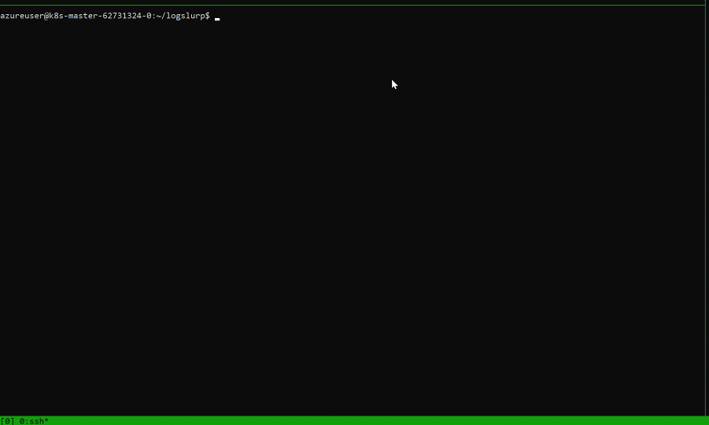

> This repo is no longer maintained. If you want to collect logs for Windows nodes on AKS, use this script. https://github.com/Azure/aks-engine/blob/master/scripts/collect-windows-logs.ps1 It is more thorough than this older prototype.


# logslurp

This will find all the Windows Kubernetes nodes, and attempt to gather all the logs from `c:\k\*.log` into a single zip file. 

Prerequisites:

- Windows nodes must have PowerShell remoting enabled, and allow basic auth with SSL. [This script](https://raw.githubusercontent.com/ansible/ansible/devel/examples/scripts/ConfigureRemotingForAnsible.ps1) makes it easy

## Build it

```
docker build -t logslurp . 
```

## Run it

Use the container to pull logs from all nodes:

```
docker run -i -t -v ~/.kube/config:/root/.kube/config -v $PWD:/opt/k/out logslurp
```




## Run it with OpenSSH instead of WinRM

Running the script

```
./logslurp.sh  user@<masternode>.westus2.cloudapp.azure.com user@2155k8s001
```

```
Get-WinEvent : No events were found that match the specified selection criteria.
At line:1 char:854
+ ...  $crashes = Get-WinEvent -FilterHashtable @{logname='Application'; Pr ...
+                 ~~~~~~~~~~~~~~~~~~~~~~~~~~~~~~~~~~~~~~~~~~~~~~~~~~~~~~~~~
    + CategoryInfo          : ObjectNotFound: (:) [Get-WinEvent], Exception
    + FullyQualifiedErrorId : NoMatchingEventsFound,Microsoft.PowerShell.Commands.GetWinEventCommand

File c:\k\debug\dumpVfpPolicies.ps1 already exists.
File c:\k\debug\hns.psm1 already exists.
File c:\k\debug\starthnstrace.cmd already exists.
File c:\k\debug\startpacketcapture.cmd already exists.
File c:\k\debug\stoppacketcapture.cmd already exists.
WARNING: The names of some imported commands from the module 'hns' include unapproved verbs that might make
them less discoverable. To find the commands with unapproved verbs, run the Import-Module command again with
the Verbose parameter. For a list of approved verbs, type Get-Verb.
C:\k\debug\4ma2yxql.i5s
File c:\k\debug\VFP.psm1 already exists.
Logs are available at C:\k\debug\4ma2yxql.i5s
Compressing all logs to 2155k8s001-20190222-021212_logs.zip
C:\Users\azureuser\2155k8s001-20190222-021212_logs.zip
Connection to 10.240.0.4 closed.
2155k8s001-20190222-021212_logs.zip                                           100%   19KB 288.5KB/s   00:00

```

Now, you can read the logs from the zip file on the local machine.


```
scp -o "ProxyCommand ssh -W %h:%p azureuser@<masterNode>.westus2.cloudapp.azure.com" azureuser@2709k8s010:'C:\Users\azureuser\2709k8s010-20190208-121004_logs.zip' .
```
